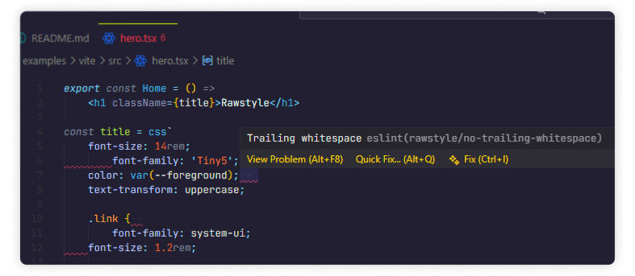

<div align="center">
	
	<br>
	An ESLint plugin for <b>formatting CSS inside Rawstyle templates</b>
	<br><br>
	<p>
		<a href="https://www.npmjs.com/package/rawstyle-eslint"></a>&nbsp;
		<a href="https://www.npmjs.com/package/rawstyle-eslint"></a>&nbsp;
		<a href="https://github.com/rawstylecss/rawstyle-eslint/blob/master/LICENSE"></a>&nbsp;
		<a href="https://github.com/rawstylecss/rawstyle-eslint/issues?q=is%3Aissue+is%3Aopen+label%3Abug"></a>
	</p>
	<p><b>
		<a href="#-features">Features</a>&nbsp; •&nbsp;
		<a href="#%EF%B8%8F-setup">Setup</a>&nbsp; •&nbsp;
		<a href="#-rules">Rules</a>
	</b></p>
	
</div>

## 🔥 Features

- **✏️ Indentation:** enforce consistent indentation in CSS templates
- **🧹 Trailing Whitespace:** remove trailing whitespace in CSS blocks
- **⚡ Auto-fixable:** seamless integration with editor and CLI autofix
- **💎 Vanilla CSS Support:** the plugin can also be applied to regular `.css` files

## ⚙️ Setup

1. Install the plugin:

```bash
pnpm add -D rawstyle-eslint
```

2. Add the plugin to your ESLint configuration:

```ts
import rawstyle from 'rawstyle-eslint'
// ...
export default defineConfig([
	// via the recommended config:
	{
		name: 'Rawstyle Rules',
		files: ['**/*.ts?(x)'],
		extends: [rawstyle.configs.recommended],
		// plugins: { rawstyle }, // not necessary when using the recommended config
		rules: { 'rawstyle/indent': 'off' }, // can still override rules here
	},
	// or directly:
	{
		name: 'Rawstyle Rules',
		files: ['**/*.ts?(x)'],
		plugins: { rawstyle },
		rules: {
			'rawstyle/indent': 'error',
			'rawstyle/no-trailing-whitespace': 'error',
		},
	},
	// for vanilla CSS files:
	{
		name: 'CSS Rules',
		files: ['**/*.css'],
		language: 'rawstyle/css', // do not specify this if you're using
		// the `@eslint/css` plugin and have already set
		// the `language` for `**/*.css` files
		extends: [rawstyle.configs.recommended],
	},
])
```

> [!WARNING]
> Do not mix `.ts(x)` and `.css` file patterns in the same config object (e.g. `files: ['**/*.{ts,tsx,css}']`) — CSS files require a different parser.

> [!NOTE]
> Make sure you are using the `@typescript-eslint` plugin to enable ESLint support for `.ts(x)` files.

## 🧩 Rules

💼 – set in the `recommended` configuration  
🔧 – automatically fixable

| Rule Name | Description | 💼 | 🔧 |
|-----------|-------------|----|-----|
| `indent` | Enforce consistent indentation | ✔️ | ✔️ |
| `no-trailing-whitespace` | Disallow trailing whitespace | ✔️ | ✔️ |

<br>

<div align="center">
	<b>MIT License © 2026 <a href="https://github.com/rawstylecss">Rawstyle</a></b>
</div>